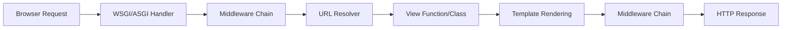

## Overview

Django follows the **Model-View-Template (MVT)** architectural pattern, a variant of Model-View-Controller (MVC). This separation of concerns makes Django applications maintainable, scalable, and testable.

<Note>
  Django's "View" is similar to a "Controller" in MVC, while Django's "Template" corresponds to the "View" in MVC terminology.
</Note>

## The MVT Pattern

### Model Layer

Models define your data structure and handle database interactions. They're defined in Python and Django translates them into database tables.

```python
from django.db import models

class Article(models.Model):
    title = models.CharField(max_length=200)
    content = models.TextField()
    published_date = models.DateTimeField(auto_now_add=True)
    
    class Meta:
        ordering = ['-published_date']
```

### View Layer

Views contain the business logic that processes requests and returns responses. From `django.views.generic.base`:

```python
from django.views import View
from django.http import HttpResponse

class ArticleView(View):
    """Process HTTP methods via dispatch"""
    
    def get(self, request, *args, **kwargs):
        # View logic here
        return HttpResponse("Article content")
    
    def post(self, request, *args, **kwargs):
        # Handle POST request
        return HttpResponse("Article created")
```

### Template Layer

Templates define how data is presented to users. Django's template engine compiles template strings into renderable objects:

```html
<!-- article.html -->
<article>
  <h1>{{ article.title }}</h1>
  <time>{{ article.published_date|date:"F j, Y" }}</time>
  <div>{{ article.content|safe }}</div>
</article>
```

## Request/Response Flow

Here's how Django processes an HTTP request:



### Detailed Request Flow

1. **Request Arrives**: The WSGI/ASGI handler receives the HTTP request
2. **Middleware Processing**: Request passes through middleware (`BaseHandler.load_middleware`)
3. **URL Resolution**: `URLResolver` matches the URL pattern and extracts parameters
4. **View Execution**: The matched view function or class method is called
5. **Template Rendering**: If needed, the template is compiled and rendered with context
6. **Response Middleware**: Response passes back through middleware chain
7. **Response Sent**: Final HTTP response is returned to the client

<Warning>
  The order of middleware in `settings.MIDDLEWARE` matters! Request middleware runs top-to-bottom, response middleware runs bottom-to-top.
</Warning>

## Core Components

### URL Dispatcher

The URL dispatcher maps URL patterns to views using regular expressions or path converters:

```python
# urls.py
from django.urls import path, re_path
from . import views

urlpatterns = [
    path('articles/<int:pk>/', views.article_detail, name='article-detail'),
    re_path(r'^archive/(?P<year>[0-9]{4})/$', views.year_archive),
]
```

### Request Handler

From `django.core.handlers.base`, the `BaseHandler` class orchestrates the entire request/response cycle:

- `load_middleware()`: Builds the middleware chain
- `get_response()`: Returns an HttpResponse for a given HttpRequest
- `_get_response()`: Resolves and calls the view, applies middleware

### Database Layer

Django's ORM abstracts database operations:

```python
# Query examples
articles = Article.objects.filter(published_date__year=2024)
article = Article.objects.get(pk=1)
Article.objects.create(title="New Article", content="Content")
```

## Async Support

Django supports both synchronous and asynchronous views. From the source code, views can be detected as async:

```python
from django.views import View

class AsyncArticleView(View):
    async def get(self, request, *args, **kwargs):
        # Async view logic
        data = await fetch_article_async()
        return HttpResponse(data)
```

<Tip>
  Use `view_is_async` property to check if a view class uses async handlers. All HTTP method handlers must be consistently sync or async.
</Tip>

## Project Structure

A typical Django project follows this structure:

```
myproject/
├── manage.py              # Command-line utility
├── myproject/             # Project package
│   ├── __init__.py
│   ├── settings.py        # Configuration
│   ├── urls.py            # URL declarations
│   ├── asgi.py            # ASGI entry point
│   └── wsgi.py            # WSGI entry point
└── myapp/                 # Application package
    ├── __init__.py
    ├── models.py          # Data models
    ├── views.py           # View logic
    ├── urls.py            # App-specific URLs
    ├── templates/         # HTML templates
    ├── static/            # CSS, JS, images
    └── migrations/        # Database migrations
```

## Settings Configuration

Django's architecture is configured through `settings.py`:

```python
# Essential settings
INSTALLED_APPS = [
    'django.contrib.admin',
    'django.contrib.auth',
    'myapp',
]

MIDDLEWARE = [
    'django.middleware.security.SecurityMiddleware',
    'django.middleware.common.CommonMiddleware',
    'django.middleware.csrf.CsrfViewMiddleware',
]

DATABASES = {
    'default': {
        'ENGINE': 'django.db.backends.postgresql',
        'NAME': 'mydatabase',
    }
}

ROOT_URLCONF = 'myproject.urls'
```

## Best Practices

1. **Keep Views Thin**: Move business logic to models or separate service layers
2. **Use Generic Views**: Leverage Django's class-based views for common patterns
3. **Organize by App**: Split functionality into reusable Django apps
4. **Follow MVT Strictly**: Don't mix business logic into templates
5. **Cache Strategically**: Use Django's caching framework at appropriate layers

<Warning>
  Avoid circular imports between models, views, and URLs by using string references or lazy loading patterns.
</Warning>

## Next Steps

- Learn about [Models](/concepts/models) for database design
- Explore [Views](/concepts/views) for handling business logic
- Understand [Templates](/concepts/templates) for rendering HTML
- Master [URL Routing](/concepts/urls) for mapping URLs to views