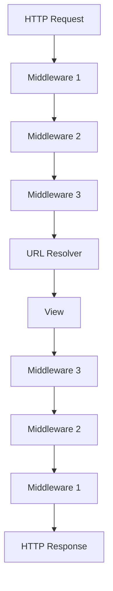

## Overview

Middleware is a framework of hooks that process requests and responses globally before they reach views or after they leave views. From `django.core.handlers.base`, the `BaseHandler` loads and chains middleware together.

<Note>
  Middleware sits between the web server and Django views, allowing you to modify requests before views see them and responses before they're sent to clients.
</Note>

## How Middleware Works

### Request/Response Flow



Middleware processes requests **top-to-bottom** and responses **bottom-to-top**.

## Creating Middleware

### Function-Based Middleware

```python
# myapp/middleware.py

def simple_middleware(get_response):
    """Simple function-based middleware"""
    
    # One-time configuration and initialization
    print("Middleware initialized")
    
    def middleware(request):
        # Code executed for each request before the view
        print(f"Request: {request.method} {request.path}")
        
        # Add custom attribute to request
        request.custom_attr = 'custom value'
        
        # Call the next middleware or view
        response = get_response(request)
        
        # Code executed for each response after the view
        print(f"Response status: {response.status_code}")
        
        # Modify response
        response['X-Custom-Header'] = 'value'
        
        return response
    
    return middleware
```

### Class-Based Middleware

```python
class CustomMiddleware:
    """Class-based middleware with multiple hooks"""
    
    def __init__(self, get_response):
        """One-time initialization"""
        self.get_response = get_response
        print("Middleware initialized")
    
    def __call__(self, request):
        """Called for each request"""
        # Request processing
        self.process_request(request)
        
        # Get response from next middleware/view
        response = self.get_response(request)
        
        # Response processing
        self.process_response(request, response)
        
        return response
    
    def process_request(self, request):
        """Process request before view"""
        request.start_time = time.time()
    
    def process_response(self, request, response):
        """Process response after view"""
        if hasattr(request, 'start_time'):
            duration = time.time() - request.start_time
            response['X-Request-Duration'] = str(duration)
        return response
```

### Using MiddlewareMixin

From `django.utils.deprecation.MiddlewareMixin`:

```python
from django.utils.deprecation import MiddlewareMixin

class RequestLoggingMiddleware(MiddlewareMixin):
    """Log all requests and responses"""
    
    def process_request(self, request):
        """Called before view is executed"""
        print(f"[{datetime.now()}] {request.method} {request.path}")
        # Return None to continue processing
        return None
    
    def process_response(self, request, response):
        """Called after view returns response"""
        print(f"[{datetime.now()}] Response: {response.status_code}")
        return response
    
    def process_view(self, request, view_func, view_args, view_kwargs):
        """Called just before view is executed"""
        print(f"Calling view: {view_func.__name__}")
        return None
    
    def process_exception(self, request, exception):
        """Called if view raises exception"""
        print(f"Exception: {exception}")
        return None
    
    def process_template_response(self, request, response):
        """Called for TemplateResponse objects"""
        if hasattr(response, 'context_data'):
            response.context_data['middleware_data'] = 'injected'
        return response
```

<Tip>
  Use `MiddlewareMixin` for backward compatibility. It provides the traditional middleware hooks: `process_request`, `process_view`, `process_template_response`, `process_response`, and `process_exception`.
</Tip>

## Middleware Hooks

### Request Processing

```python
class RequestProcessingMiddleware:
    def __init__(self, get_response):
        self.get_response = get_response
    
    def __call__(self, request):
        # Modify request before view
        if request.user.is_authenticated:
            request.user_type = 'authenticated'
        else:
            request.user_type = 'anonymous'
        
        # Add custom headers
        request.META['HTTP_X_CUSTOM'] = 'value'
        
        response = self.get_response(request)
        return response
```

### Response Processing

```python
class ResponseProcessingMiddleware:
    def __init__(self, get_response):
        self.get_response = get_response
    
    def __call__(self, request):
        response = self.get_response(request)
        
        # Add headers to all responses
        response['X-Content-Type-Options'] = 'nosniff'
        response['X-Frame-Options'] = 'DENY'
        
        # Modify response content
        if response.get('Content-Type', '').startswith('text/html'):
            # Add footer to HTML responses
            response.content += b'<!-- Generated by Django -->'
        
        return response
```

### Exception Handling

```python
from django.http import JsonResponse
import logging

logger = logging.getLogger(__name__)

class ExceptionHandlingMiddleware(MiddlewareMixin):
    """Handle exceptions globally"""
    
    def process_exception(self, request, exception):
        """Called when view raises exception"""
        logger.error(f"Exception in {request.path}: {exception}")
        
        # Return custom error response
        if request.path.startswith('/api/'):
            return JsonResponse({
                'error': 'Internal server error',
                'message': str(exception)
            }, status=500)
        
        # Return None to let Django handle it
        return None
```

## Built-in Middleware

From `django.middleware`, Django includes several built-in middleware classes:

### Common Middleware

From `django.middleware.common.CommonMiddleware`:

```python
# settings.py
MIDDLEWARE = [
    'django.middleware.common.CommonMiddleware',
]

# Features:
# - Append slashes to URLs (APPEND_SLASH)
# - Prepend www to URLs (PREPEND_WWW)
# - Block forbidden user agents (DISALLOWED_USER_AGENTS)
# - Set Content-Length header
```

### Security Middleware

```python
MIDDLEWARE = [
    'django.middleware.security.SecurityMiddleware',
]

# Security headers:
# - Strict-Transport-Security (HSTS)
# - X-Content-Type-Options
# - X-Frame-Options
# - Redirect HTTP to HTTPS
```

### CSRF Middleware

```python
MIDDLEWARE = [
    'django.middleware.csrf.CsrfViewMiddleware',
]

# Protects against Cross-Site Request Forgery attacks
# Validates CSRF tokens on POST requests
```

### Session Middleware

```python
MIDDLEWARE = [
    'django.contrib.sessions.middleware.SessionMiddleware',
]

# Enables session support
# Makes request.session available in views
```

### Authentication Middleware

```python
MIDDLEWARE = [
    'django.contrib.auth.middleware.AuthenticationMiddleware',
]

# Associates users with requests
# Makes request.user available in views
# Requires SessionMiddleware
```

## Configuring Middleware

Configure middleware in `settings.py`:

```python
# settings.py
MIDDLEWARE = [
    # Security
    'django.middleware.security.SecurityMiddleware',
    
    # Sessions
    'django.contrib.sessions.middleware.SessionMiddleware',
    
    # Common
    'django.middleware.common.CommonMiddleware',
    
    # CSRF protection
    'django.middleware.csrf.CsrfViewMiddleware',
    
    # Authentication
    'django.contrib.auth.middleware.AuthenticationMiddleware',
    
    # Messages
    'django.contrib.messages.middleware.MessageMiddleware',
    
    # Clickjacking protection
    'django.middleware.clickjacking.XFrameOptionsMiddleware',
    
    # Custom middleware
    'myapp.middleware.CustomMiddleware',
    'myapp.middleware.RequestLoggingMiddleware',
]
```

<Warning>
  Middleware order matters! For example, `AuthenticationMiddleware` must come after `SessionMiddleware`, and security middleware should be early in the list.
</Warning>

## Common Middleware Patterns

### Request Timer

```python
import time
import logging

logger = logging.getLogger(__name__)

class RequestTimerMiddleware:
    """Log request processing time"""
    
    def __init__(self, get_response):
        self.get_response = get_response
    
    def __call__(self, request):
        start_time = time.time()
        
        response = self.get_response(request)
        
        duration = time.time() - start_time
        logger.info(f"{request.method} {request.path} took {duration:.3f}s")
        
        return response
```

### User Activity Tracking

```python
class UserActivityMiddleware:
    """Track user last activity"""
    
    def __init__(self, get_response):
        self.get_response = get_response
    
    def __call__(self, request):
        response = self.get_response(request)
        
        if request.user.is_authenticated:
            # Update last activity timestamp
            request.user.last_activity = timezone.now()
            request.user.save(update_fields=['last_activity'])
        
        return response
```

### IP Whitelist

```python
from django.core.exceptions import PermissionDenied

class IPWhitelistMiddleware:
    """Restrict access by IP address"""
    
    WHITELIST = ['127.0.0.1', '192.168.1.1']
    
    def __init__(self, get_response):
        self.get_response = get_response
    
    def __call__(self, request):
        ip = self.get_client_ip(request)
        
        if ip not in self.WHITELIST:
            raise PermissionDenied("Access denied")
        
        return self.get_response(request)
    
    def get_client_ip(self, request):
        x_forwarded_for = request.META.get('HTTP_X_FORWARDED_FOR')
        if x_forwarded_for:
            ip = x_forwarded_for.split(',')[0]
        else:
            ip = request.META.get('REMOTE_ADDR')
        return ip
```

### API Rate Limiting

```python
from django.core.cache import cache
from django.http import JsonResponse

class RateLimitMiddleware:
    """Rate limit API requests"""
    
    def __init__(self, get_response):
        self.get_response = get_response
    
    def __call__(self, request):
        if request.path.startswith('/api/'):
            # Check rate limit
            key = f"rate_limit_{request.user.id or request.META.get('REMOTE_ADDR')}"
            requests = cache.get(key, 0)
            
            if requests >= 100:  # 100 requests per hour
                return JsonResponse({
                    'error': 'Rate limit exceeded'
                }, status=429)
            
            # Increment counter
            cache.set(key, requests + 1, 3600)  # 1 hour timeout
        
        return self.get_response(request)
```

### Content Compression

```python
import gzip
from django.utils.cache import patch_vary_headers

class GzipMiddleware:
    """Compress responses with gzip"""
    
    def __init__(self, get_response):
        self.get_response = get_response
    
    def __call__(self, request):
        response = self.get_response(request)
        
        # Check if client accepts gzip
        if 'gzip' not in request.META.get('HTTP_ACCEPT_ENCODING', ''):
            return response
        
        # Only compress text content
        if response.get('Content-Type', '').startswith('text/'):
            response.content = gzip.compress(response.content)
            response['Content-Encoding'] = 'gzip'
            response['Content-Length'] = str(len(response.content))
            patch_vary_headers(response, ('Accept-Encoding',))
        
        return response
```

## Async Middleware

Django supports asynchronous middleware:

```python
import asyncio

class AsyncMiddleware:
    """Async middleware example"""
    
    async_capable = True
    sync_capable = True
    
    def __init__(self, get_response):
        self.get_response = get_response
    
    async def __call__(self, request):
        # Async request processing
        await asyncio.sleep(0.1)
        
        response = await self.get_response(request)
        
        # Async response processing
        await asyncio.sleep(0.1)
        
        return response
```

<Note>
  Set `async_capable = True` and `sync_capable = True` to indicate middleware supports both sync and async modes. Django will adapt based on the view type.
</Note>

## Testing Middleware

```python
from django.test import TestCase, RequestFactory
from myapp.middleware import CustomMiddleware

class MiddlewareTest(TestCase):
    def setUp(self):
        self.factory = RequestFactory()
        self.middleware = CustomMiddleware(lambda request: HttpResponse())
    
    def test_middleware_adds_header(self):
        request = self.factory.get('/test/')
        response = self.middleware(request)
        
        self.assertEqual(response['X-Custom-Header'], 'value')
    
    def test_middleware_modifies_request(self):
        request = self.factory.get('/test/')
        self.middleware(request)
        
        self.assertTrue(hasattr(request, 'custom_attr'))
```

## Best Practices

1. **Order matters**: Place middleware in correct order in `MIDDLEWARE` setting
2. **Keep it lightweight**: Middleware runs on every request
3. **Handle errors gracefully**: Don't let middleware crash the application
4. **Return responses carefully**: Only return responses to short-circuit processing
5. **Use caching**: Cache expensive operations in middleware
6. **Test thoroughly**: Middleware affects all requests

<Warning>
  Returning a response from middleware short-circuits the remaining middleware and view processing. Only do this when necessary (e.g., authentication failure, rate limiting).
</Warning>

## Next Steps

- Learn about [Views](/concepts/views) that middleware wraps
- Explore [URL Routing](/concepts/urls) that happens after middleware
- Understand [Security](/security/overview) middleware configuration