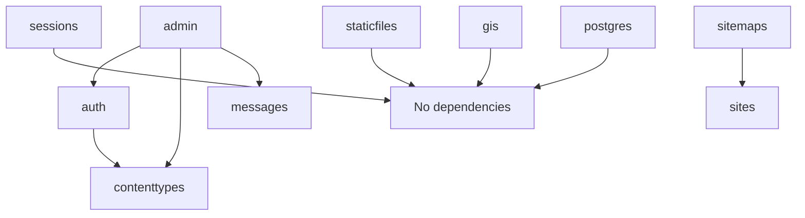

Django includes a collection of "contrib" packages that provide common functionality for web applications. These packages are optional but widely used and production-ready.

## Available Packages

<CardGroup cols={2}>
  <Card title="Admin" icon="shield-halved" href="/contrib/admin">
    Automatic admin interface for managing your models
  </Card>
  <Card title="Auth" icon="users" href="/contrib/auth">
    User authentication, permissions, and groups system
  </Card>
  <Card title="ContentTypes" icon="database" href="/contrib/contenttypes">
    Generic relations and content type framework
  </Card>
  <Card title="Messages" icon="envelope" href="/contrib/messages">
    One-time notification messages for users
  </Card>
  <Card title="Sessions" icon="clock" href="/contrib/sessions">
    Anonymous and user session management
  </Card>
  <Card title="StaticFiles" icon="file" href="/contrib/staticfiles">
    Static file collection and serving
  </Card>
  <Card title="GIS" icon="map" href="/contrib/gis">
    Geographic database features (GeoDjango)
  </Card>
  <Card title="PostgreSQL" icon="database" href="/contrib/postgres">
    PostgreSQL-specific database features
  </Card>
  <Card title="Syndication" icon="rss" href="/contrib/syndication">
    RSS and Atom feed generation
  </Card>
  <Card title="Sitemaps" icon="sitemap" href="/contrib/sitemaps">
    XML sitemap generation for SEO
  </Card>
</CardGroup>

## Installation

All contrib packages are located in `django.contrib` and must be added to your `INSTALLED_APPS` setting:

```python settings.py
INSTALLED_APPS = [
    'django.contrib.admin',
    'django.contrib.auth',
    'django.contrib.contenttypes',
    'django.contrib.sessions',
    'django.contrib.messages',
    'django.contrib.staticfiles',
    # Optional packages
    'django.contrib.gis',
    'django.contrib.postgres',
    'django.contrib.sitemaps',
    'django.contrib.syndication',
]
```

<Note>
Most contrib packages have dependencies on each other. For example, `admin` requires `auth` and `contenttypes`.
</Note>

## Core Packages

### Admin

Provides an automatic admin interface for your models. Features include:
- Automatic CRUD operations
- List filtering and searching
- Inline editing
- Custom actions
- Permissions integration

### Auth

Provides user authentication and authorization:
- User model with authentication
- Permissions and groups
- Login/logout views
- Password hashing
- Decorators for view protection

### ContentTypes

Enables generic relations between models:
- Track all installed models
- Create foreign keys to any model
- Power features like admin's LogEntry

### Messages

One-time notification messages:
- Flash messages across requests
- Multiple message levels (debug, info, success, warning, error)
- Template integration
- Pluggable storage backends

### Sessions

Manage user sessions:
- Anonymous and authenticated sessions
- Multiple backends (database, cache, file, cookie)
- Session expiration
- Secure session handling

### StaticFiles

Manage static assets:
- Collect static files from apps
- Development file serving
- Template tags for static URLs
- Storage backends

## Database-Specific Packages

### GIS (GeoDjango)

Geographic database capabilities:
- Spatial database fields
- GIS querysets and lookups
- Support for PostGIS, MySQL, Oracle, SQLite
- Integration with GDAL/GEOS

### PostgreSQL

PostgreSQL-specific features:
- Array fields
- JSON fields
- Range fields
- Full-text search
- Database constraints

## Utility Packages

### Syndication

Generate RSS and Atom feeds:
- Feed class framework
- Automatic feed generation
- Customizable feed attributes
- Template-based item rendering

### Sitemaps

Generate XML sitemaps:
- Automatic sitemap generation
- Multiple sitemap support
- Internationalization support
- Integration with Django's sites framework

<Tip>
Start with the core packages (admin, auth, contenttypes, sessions, messages, staticfiles) which work together to provide a complete foundation for most Django projects.
</Tip>

## Package Dependencies

Many contrib packages depend on each other:



<Note>
Always include `contenttypes` when using `auth` or `admin`, and include `sessions` and `messages` when using the full Django stack.
</Note>
